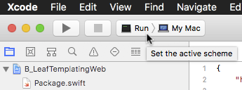

B: Leaf Templating
==================

<a id="toc"></a>
[<< Main Contents Page](https://github.com/VaporExamplesLab/ServerSideSwift__Index) | |
[Background](#Background) |
[Notes](#Notes) |
[Running](#Running) |
[Basic HTML](#BasicHtml) |
[`#(variable)`](#Variable) |
[String Parameter](#StringParameter) |
[Loop Parameter](#LoopParameter) |
[`#embed`,`#extend`,`#export`](#EmbedExtendExport) |
[`#if(){…}##else{…}`](#IfElse) |
[`raw(){…}`](#raw) |
[Resources](#Resources)

_Prerequisite: [Vapor Development Environment Installation](../../Vapor__INSTALL.md)_

_The `B_LeafTemplatingWeb` project provides an example Vapor 2 + Swift 4 implementation based on the raywenderlich.com "Server Side Swift 3 with Vapor: Templating with Leaf" tutorial.  The original tutorial still need to be viewed for concept discussion._

[ ](https://www.youtube.com/watch?v=KZX5VN5uHB0)  
Video 2 "Server Side Swift 3 with Vapor: Templating with Leaf" - [raywenderlich.com ⇗](https://videos.raywenderlich.com/screencasts/511-server-side-swift-with-vapor-templating-with-leaf) [YouTube ⇗](https://www.youtube.com/watch?v=KZX5VN5uHB0)

Background <a id="Background">[▴](#toc)</a>
----------

Project `B_LeafTemplatingWeb` was setup for Vapor 2 and Swift 4 development on macOS with the commands below. Some sub-packages may use Swift 3.2, which is compatible of Swift 4.

``` sh
vapor --version
# Vapor Toolbox: 3.0.2
vapor new B_LeafTemplatingWeb --template=web
# change directory to B_LeafTemplatingWeb
cd B_LeafTemplatingWeb
mv Package.pins Package.pins.bak

#
mkdir Sources/App/Routes 
mv Sources/App/Routes/Routes.swift Sources/App/Routes/Routes.swift 
mkdir Sources/App/Setup
mv Sources/App/Config+Setup.swift Sources/App/Setup/Config+Setup.swift 
mv Sources/App/Droplet+Setup.swift Sources/App/Setup/Droplet+Setup.swift 

### manually update Package.swift for Swift 4
cp Package.swift Package.swift.bak
swift package tools-version # 3.1.0
swift package tools-version --set-current
swift package tools-version # 4.0.0
edit Package.swift

# ceate & open Xcode project
vapor xcode -y     # -y option automatically opens Xcode project 
```

Notes <a id="Notes">[▴](#toc)</a>
-----

#### Important Edit Locations:

Leaf files such as hello.leaf, master.leaf and title.leaf are added to [Resources/Views](Resources/Views).

Routes are placed in [Sources/App/Routes/Routes.swift](Sources/App/Routes/Routes.swift) instead of `main.swift`.

Running <a id="Running">[▴](#toc)</a>
-------

Set the Xcode scheme to `Run > My Mac`. After the scheme is set, Xcode can clean, build, run, and debug the Vapor project.



The script [LeafTemplating.sh](README_files/LeafTemplating.sh) can run the examples from the commandline.

``` sh
# change permissions if needed to make script executable
chmod +x README_files/LeafTemplating.sh
# run script
cd README_files
./LeafTemplating.sh  # run script 
```


#### Example Notes: 

Example Vapor 2 Leaf `*.leaf` templates have been added to the [`Resources/Views/`](Resources/Views) folder. The url template routes which use the various `*.leaf` files are edited into the [`Sources/App/Routes/Routes.swift`](Sources/App/Routes/Routes.swift) file.

| url       | leaf template |       | 
| --------- | ------------- | ----- |
| template0 | hello0.leaf   | no templating, basic HTML
| template1 | hello1.leaf   | template `#(variable)`
| template2 | hello1.leaf   | url `/parameter`
| template3a | hello2a.leaf | template `#loop`
| template3b | hello2b.leaf | template `#loop`, `#(variable.field)` 
| template4a | hello3a.leaf | template `#embed`
| template4b | hello3b.leaf | template `#extend`, `#export`  
| template5a | hello4a.leaf | template `#if () { } ##else { }`
| template5b | hello4b.leaf | template `#raw { }`  

Note: do not use `#` in `.leaf` file comments. If needed, place `#` inside a `#raw { }` like `#raw { #something }`.

Basic HTML <a id="BasicHtml">[▴](#toc)</a>
----------

_Basic HTML. No templating._

Added: [`/Resources/Views/hello0.leaf`](Resources/Views/hello0.leaf)

Modified: [Routes.swift](Sources/App/Routes/Routes.swift)

``` swift
builder.get("template0") { 
    (req: Request) -> ResponseRepresentable in
    return try self.view.make("hello0")
}
``` 

URL: `http://localhost:8080/template0`  

<a id="Variable"></a>
`#(variable)` [▴](#toc)
------------- 

_`#name` template parameter. Hard coded "dynamic" data._

Added: [`/Resources/Views/hello1.leaf`](Resources/Views/hello1.leaf) plain HTML

``` html
<h1>Hello, #(name)!</h1>
``` 

Modified File: [`Routes.swift`](Sources/App/Routes/Routes.swift)

``` swift
builder.get("template1") { 
    (req: req) -> ResponseRepresentable in
    return try self.view.make("hello1", Node(node: ["name": "Ray"])
}
``` 

URL: `http://localhost:8080/template1`  


String Parameter <a id="StringParameter">[▴](#toc)</a>
----------------

_`#name` template parameter. Use dynamic data from URL._

``` swift
builder.get("template2", String.parameter) { 
    (req: Request) -> ResponseRepresentable in
    do {
        let name = try req.parameters.next(String.self) // type safe
        return try self.view.make("hello1", Node(node: ["name": name]))
    }
    catch {
        return try JSON(node: ["error": "template 2 failed"])   
    }
}
``` 

URL: `http://localhost:8080/template2/Roger`, `http://localhost:8080/template2/27` 

Loop Parameter <a id="LoopParameter">[▴](#toc)</a>
--------------

``` html
<body>
    <!-- tag: loop, collection: users, variable: "user" -->
    #loop(users, "user") {
      <h1>Hello, #(user)!</h1>
    }
</body>
```

URL: `http://localhost:8080/template3a`  

``` html
<body>
    <!-- tag: loop, collection: users, variable: "user" -->
    #loop(users, "user") {
      <h1>Hello, #(user.name)! <a href="mailto:#(user.email)">[email]</a></h1>
    }
</body>
```

URL: `http://localhost:8080/template3b`  

`#embed`, `#extend`, `#export` <a id="EmbedExtendExport">[▴](#toc)</a>
--------------

_title.leaf_

``` html
<title>Hello, World!</title>
```

``` html
<!DOCTYPE html>
<html lang="en">
  <head>
    <!-- includes title.leaf content here -->
    #embed("title")
  </head>
  …
```

URL: `http://localhost:8080/template4a`

> Recommendation: have html tags open and close in the same leaf template.

Master Template which has place holders for where other pages will place content.

_master.leaf_

``` html
<!DOCTYPE html>
<html lang="en">
  <head>
    #import("head")
  </head>
  <body>
    #import("body")
  </body>
</html>
```

`hello3.leaf` extends the `master.leaf` by supplying (exporting) the _"head"_ and _"body"_ which `master.leaf` subsequently imports. 

``` html
#extend("master")
 
#export("head") {
  #embed("title")
}

#export("body") {
  #loop(users, "user") {
    <h1>Hello, #(user.name)! <a href="mailto:#(user.email)">[Email]</a></h1>
  }
}
```

URL: `http://localhost:8080/template4b`  

`#if(){}##else{}` <a id="IfElse">[▴](#toc)</a>
----------------

``` html
#if(sayHello) {
  <p>Hello!</p>
} ##else() {
  <p>Goodbye.</p>
}
```

URL:  
• `http://localhost:8080/template5a?sayHello=true`  
• `http://localhost:8080/template5a?sayHello=false`  

`#raw(){…}` <a id="Raw">[▴](#toc)</a>
--------

_raw() avoids interpretation of `#`_

```
#raw() { #youareawesome }
```

URL:  
• `http://localhost:8080/template5b?sayHello=true`  
• `http://localhost:8080/template5b?sayHello=false`  

Resources <a id="Resources">[▴](#toc)</a>
---------

* [Codingpedia: How to test a REST api from command line with curl ⇗](http://www.codingpedia.org/ama/how-to-test-a-rest-api-from-command-line-with-curl/)
* [Lob REST API documentation: `curl` examples ⇗](https://lob.com/docs)
* RESTed: [macOS App Store ⇗](https://itunes.apple.com/us/app/rested-simple-http-requests/id421879749), [home page ⇗](http://www.helloresolven.com/portfolio/rested/)
* [Skeleton ⇗](http://getskeleton.com) CSS framework  
* [SQLite Studio ⇗](https://sqlitestudio.pl) open source database manager
* [YouTube/rwenderlich: Server Side Swift 3 with Vapor Tutorial Series ⇗](https://www.youtube.com/playlist?list=PL23Revp-82LIXIrfus8YdqxanjaiIOUaH) _Based on Vapor 1, Swift 3._
